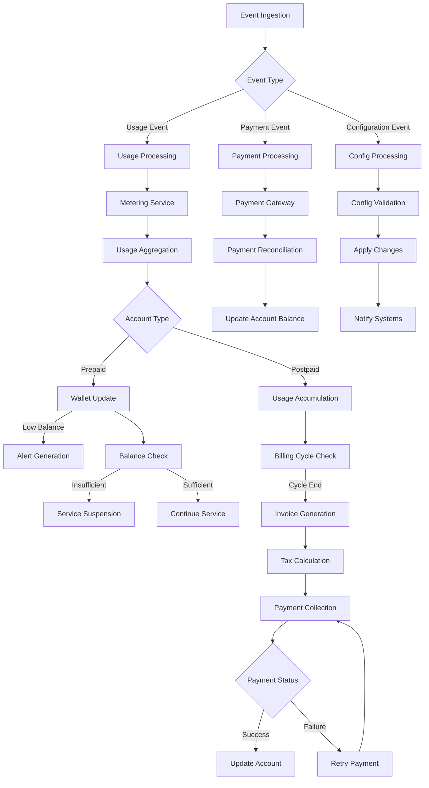
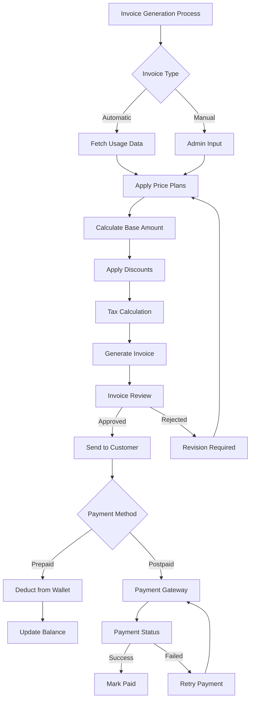
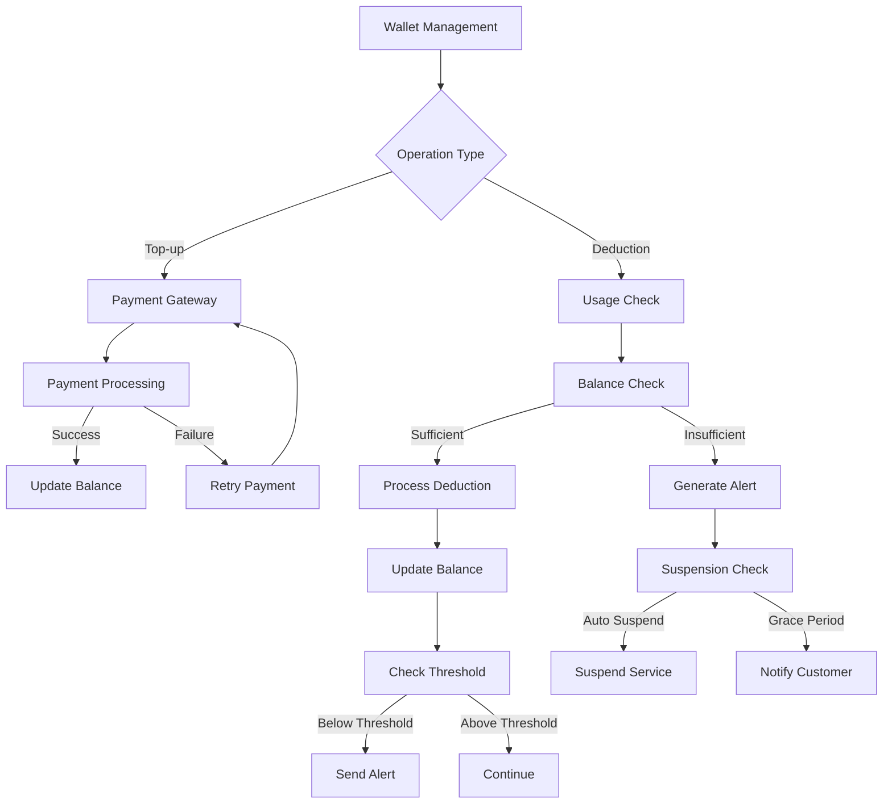
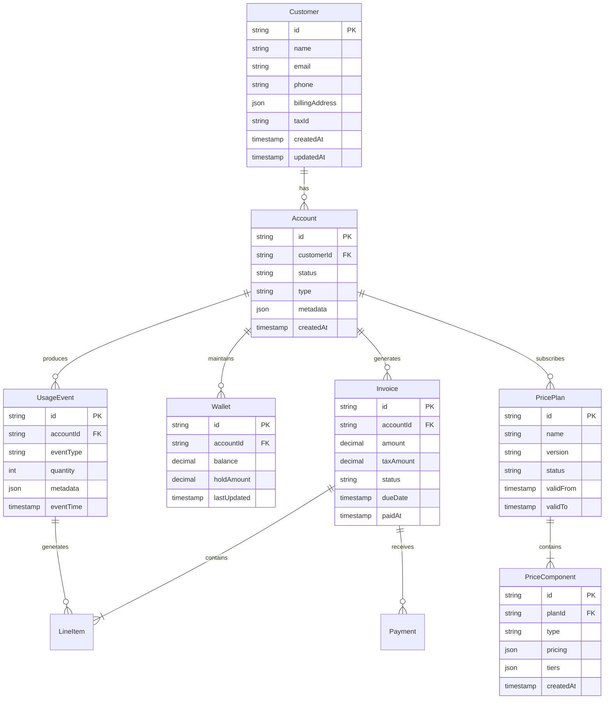
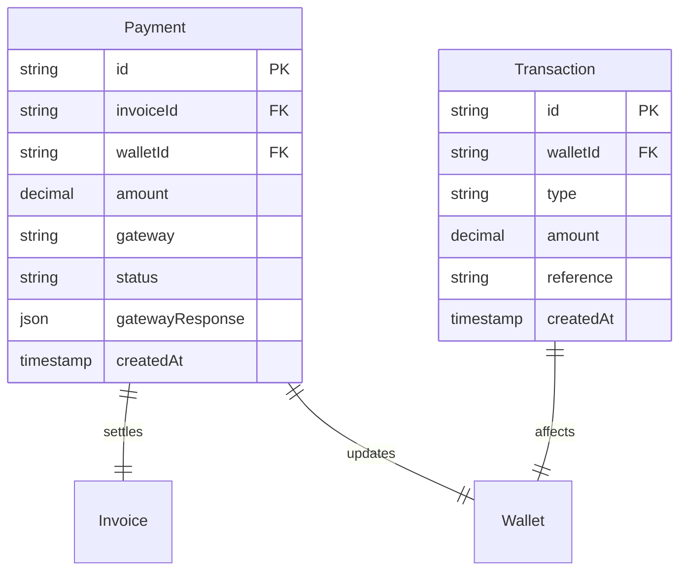
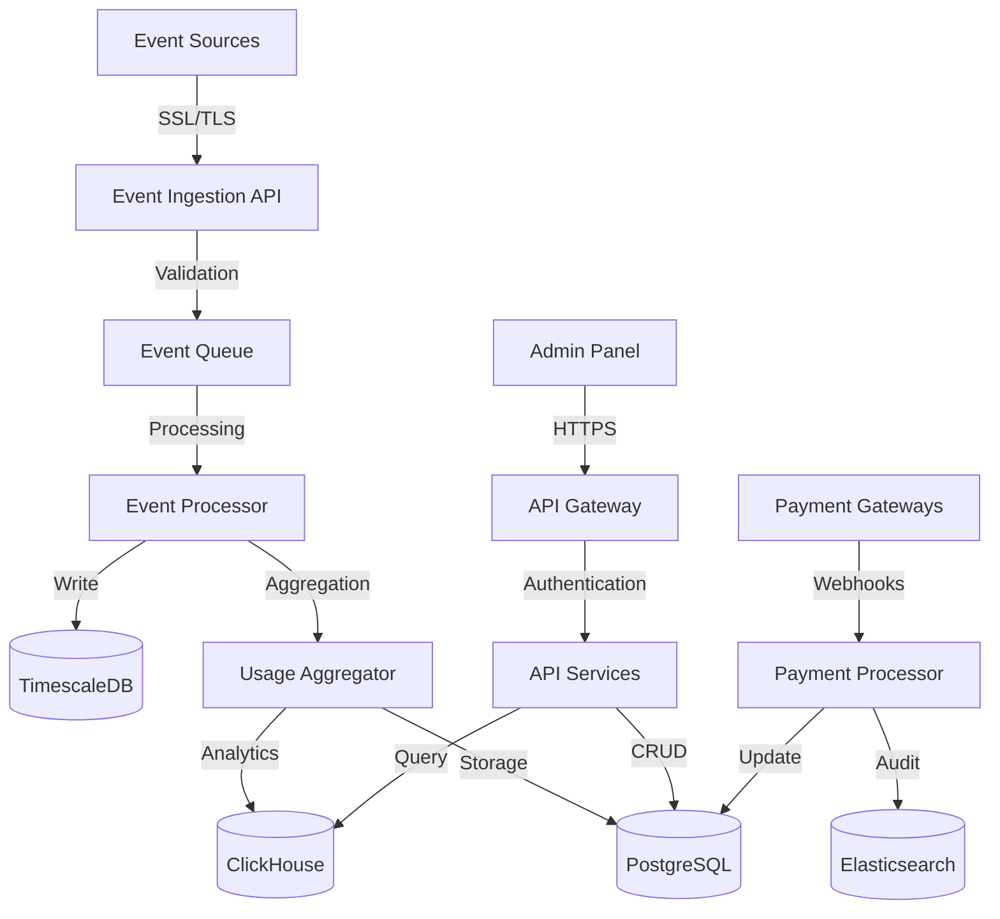
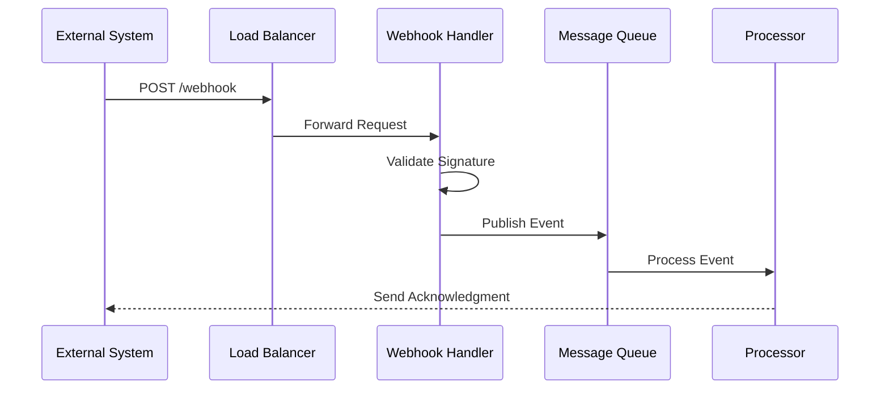
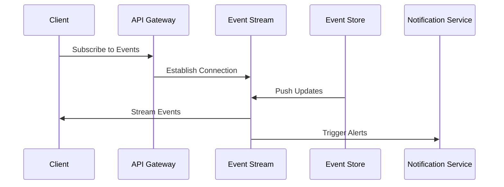

# Product Requirements Document (PRD)

# 1. INTRODUCTION

## 1.1 Purpose

This Product Requirements Document (PRD) specifies the functional and non-functional requirements for OTPless's Internal Billing System. It serves as the primary reference for the development team, stakeholders, and future maintainers of the system. The document aims to:

- Provide a comprehensive understanding of the billing system's requirements
- Establish clear guidelines for development and implementation
- Serve as a basis for system validation and verification
- Act as a contractual agreement between technical and business stakeholders

## 1.2 Scope

The Internal Billing System is a comprehensive solution designed to automate and streamline OTPless's billing operations. The system encompasses:

### 1.2.1 Core Functionalities

- Usage-based billing and metering
- Customer profile management
- Flexible pricing plan configuration
- Automated invoice generation
- Prepaid wallet management
- Payment gateway integration
- Real-time analytics and reporting

### 1.2.2 Key Benefits

- Automated revenue operations
- Reduced manual intervention
- Enhanced billing accuracy
- Real-time financial insights
- Improved customer experience
- Scalable pricing management

### 1.2.3 System Boundaries

The system will:

- Interface with OTPless's authentication service
- Integrate with payment gateways (Stripe, Razorpay)
- Provide REST APIs for internal and external consumption
- Support web-based administration interface
- Support web-based customer portal interface
- Handle tax calculations and tax invoicing for Indian GST

The system will not:

- Process actual payments (handled by payment gateways)
- Manage customer authentication (handled by OTPless core)
- Generate financial statements or handle accounting

# 2. PRODUCT DESCRIPTION

## 2.1 Product Perspective

The Internal Billing System operates as a critical component within OTPless's larger ecosystem, interfacing with several internal and external systems:

- Integrates with OTPless's core authentication service for usage data
- Connects with payment gateways (Stripe, Razorpay) for payment processing
- Exposes REST APIs for integration with other internal systems
- Provides web-based administrative interface for internal users and customer portal for external users

## 2.2 Product Functions

The system provides the following core functions:

1. Usage Metering and Event Processing

   - Real-time event ingestion
   - Usage aggregation and processing
   - Idempotency handling

2. Customer and Pricing Management

   - Customer profile administration
   - Flexible pricing plan configuration
   - Custom contract management

3. Billing Operations

   - Automated invoice generation with tax if applicable
   - Tax calculations
   - Payment processing
   - Prepaid wallet management

4. Analytics and Reporting

   - Real-time usage analytics
   - Revenue insights
   - Custom report generation

## 2.3 User Characteristics

The system caters to three primary user groups:

1. Finance Team Members

   - Advanced understanding of billing operations
   - Requires access to invoice management and payment reconciliation
   - Daily interaction with the system
   - Needs minimal technical knowledge

2. Engineering Team Members

   - High technical proficiency
   - Focuses on API integration and system maintenance
   - Requires deep understanding of event processing
   - Regular monitoring of system health

3. Product Team Members

   - Mixed technical background
   - Focuses on pricing strategy and analytics
   - Requires access to usage patterns and revenue data
   - Weekly/monthly system interaction for analysis
   - Customers  
     No technical background
     - Manage and view invoices
     - View Payment receipts and attempt
     - Manage alert settings for prepaid wallet
     - Manage customer details and notification settings

## 2.4 Constraints

1. Technical Constraints

   - Must handle minimum 1000 events per second
   - 99.9% system uptime requirement
   - Maximum 100ms latency for real-time operations
   - Data retention compliance with regulatory requirements

2. Regulatory Constraints

   - Compliance with Indian GST regulations
   - Data privacy compliance (GDPR, PDPA)
   - Financial data security requirements
   - Digital invoice format compliance

3. Business Constraints

   - Integration with existing payment gateways only
   - Must support current OTPless pricing models
   - Real-time wallet balance updates required
   - Support for INR, IDR and USD currency initially

## 2.5 Assumptions and Dependencies

### Assumptions

1. Stable network connectivity for real-time operations
2. Availability of customer usage data from OTPless core
3. Consistent event format from all data sources
4. Access to tax rate information for calculations

### Dependencies

1. External Systems

   - OTPless Authentication Service
   - Stripe Payment Gateway
   - Razorpay Payment Gateway

2. Infrastructure

   - Cloud hosting platform
   - Database management system
   - Message queue system
   - Load balancing service

3. Third-party Services

   - SMS/Email notification service
   - Analytics platform
   - Monitoring tools
   - Backup services

# 3. PROCESS FLOWCHART

# 4. FUNCTIONAL REQUIREMENTS

## 4.1 Event Processing and Metering

### ID: F001

### Description

Real-time processing and metering of authentication events from the OTPless platform.

### Priority: P0

### Requirements

| Requirement ID | Description | Acceptance Criteria |
| --- | --- | --- |
| F001.1 | Process incoming events with maximum latency of 100ms | - Event processing latency \<= 100ms - Queue monitoring in place - Error rate \< 0.01% |
| F001.2 | Support minimum 1000 events per second | - System handles 1000+ events/second - No event loss - Horizontal scaling capability |
| F001.3 | Implement idempotency checks | - Duplicate events identified and filtered - Unique event ID tracking - Idempotency window of 24 hours |
| F001.4 | Event attribution to customer accounts | - Accurate mapping to customer profiles - Support for alias IDs - Hierarchical account structure |

## 4.2 Customer Profile Management

### ID: F002

### Description

Management of customer profiles, billing information, and account hierarchies.

### Priority: P0

### Requirements

| Requirement ID | Description | Acceptance Criteria |
| --- | --- | --- |
| F002.1 | Create and update customer profiles | - CRUD operations for profiles - Validation of required fields - Audit logging |
| F002.2 | Manage billing addresses and contact info | - Multiple address support - Tax jurisdiction mapping - Contact validation |
| F002.3 | Handle account hierarchies | - Parent-child relationships - Consolidated billing options - Independent wallet management |
| F002.4 | Support for alias IDs | - Multiple identifier mapping - Cross-reference capability - Unique constraint enforcement |

## 4.3 Pricing Configuration

### ID: F003

### Description

Flexible pricing plan configuration and management system.

### Priority: P0

### Requirements

| Requirement ID | Description | Acceptance Criteria |
| --- | --- | --- |
| F003.1 | Configure pricing models | - Fixed fee support - Usage-based pricing - Subscription models |
| F003.2 | Manage rate cards | - Tiered pricing support - Volume discounts - Custom rate definitions |
| F003.3 | Version control for price plans | - Plan versioning - Migration paths - Grandfathering rules |
| F003.4 | Custom contract overrides | - Contract-specific pricing - Override management - Validity period tracking |

## 4.4 Wallet Management

### ID: F004

### Description

Prepaid wallet system for real-time balance management and usage tracking.

### Priority: P0

### Requirements

| Requirement ID | Description | Acceptance Criteria |
| --- | --- | --- |
| F004.1 | Real-time balance updates | - Atomic transactions - Concurrent access handling - Balance consistency |
| F004.2 | Top-up processing | - Multiple payment methods - Auto-top-up rules - Receipt generation |
| F004.3 | Low balance alerts | - Configurable thresholds - Multiple notification channels - Alert acknowledgment |
| F004.4 | Usage suspension | - Automatic suspension - Grace period handling - Reactivation process |

## 4.5 Invoice Generation

### ID: F005

### Description

Automated invoice generation and management system.

### Priority: P0

### Requirements

| Requirement ID | Description | Acceptance Criteria |
| --- | --- | --- |
| F005.1 | Generate invoices | - Scheduled generation - On-demand creation - Template customization |
| F005.2 | Tax calculations | - GST compliance - CGST/IGST handling - Tax rate management internally using customer tax assigned profile |
| F005.3 | Invoice workflow | - Draft/Review/Approve flow - Void capability - Amendment process |
| F005.4 | Payment tracking | - Payment status updates - Multiple payment methods - Reconciliation process |

## 4.6 Analytics and Reporting

### ID: F006

### Description

Real-time analytics and reporting system for usage and revenue insights.

### Priority: P1

### Requirements

| Requirement ID | Description | Acceptance Criteria |
| --- | --- | --- |
| F006.1 | Usage analytics | - Real-time metrics - Historical trends - Custom dimensions |
| F006.2 | Revenue reporting | - Revenue forecasting - MRR/ARR tracking - Custom report generation |
| F006.3 | Dashboard views | - Role-based access - Customizable widgets - Export capabilities |
| F006.4 | Alert management | - Threshold monitoring - Alert configuration - Notification routing |

# 5. NON-FUNCTIONAL REQUIREMENTS

## 5.1 Performance Requirements

| Requirement | Description | Target Metric |
| --- | --- | --- |
| Event Processing | Maximum latency for event ingestion and processing | ≤ 100ms |
| API Response Time | Maximum response time for API endpoints | ≤ 200ms (95th percentile) |
| Throughput | Minimum events processed per second | ≥ 1000 events/second |
| Database Operations | Maximum latency for database transactions | ≤ 50ms |
| Concurrent Users | Simultaneous users supported on admin panel | ≥ 100 users |
| Batch Processing | Maximum time for daily invoice generation batch | ≤ 1 hour |

## 5.2 Safety Requirements

| Requirement | Description | Implementation |
| --- | --- | --- |
| Data Backup | Regular backup of critical data | - Daily incremental backups - Weekly full backups - 30-day retention |
| Disaster Recovery | Recovery time and point objectives | - RTO: 4 hours - RPO: 15 minutes |
| System State | Maintenance of system state during failures | - Transaction rollback capability - State recovery mechanisms |
| Audit Trail | Tracking of all critical operations | - Comprehensive audit logging - Immutable audit records |
| Failover | Automatic failover for critical components | - Active-passive configuration - Automatic failover triggering |

## 5.3 Security Requirements

| Requirement | Description | Implementation |
| --- | --- | --- |
| Authentication | User authentication mechanisms | - OAuth 2.0 integration - MFA for admin access - API key management |
| Authorization | Role-based access control | - Granular permission system - Role hierarchy - Resource-level permissions |
| Data Encryption | Encryption standards for data | - AES-256 for data at rest - TLS 1.3 for data in transit - HSM for key management |
| API Security | API endpoint protection | - Rate limiting - Request validation - HMAC authentication |
| Audit Logging | Security event logging | - Centralized log management - Real-time alert generation - Log retention policy |

## 5.4 Quality Requirements

### 5.4.1 Availability

| Metric | Target |
| --- | --- |
| System Uptime | 99.9% |
| Planned Maintenance | ≤ 4 hours/month |
| Mean Time to Recovery | ≤ 30 minutes |

### 5.4.2 Maintainability

| Requirement | Implementation |
| --- | --- |
| Code Quality | - Automated testing coverage ≥ 80% - Static code analysis - Regular code reviews |
| Documentation | - API documentation - System architecture documentation - Operational procedures |
| Deployment | - Automated deployment pipeline - Blue-green deployment support - Rollback capabilities |

### 5.4.3 Usability

| Requirement | Implementation |
| --- | --- |
| Admin Interface | - Intuitive navigation - Responsive design - Error handling with clear messages |
| API Design | - RESTful conventions - Consistent error responses - Comprehensive documentation |
| Accessibility | - WCAG 2.1 Level AA compliance - Screen reader support - Keyboard navigation |

### 5.4.4 Scalability

| Requirement | Target |
| --- | --- |
| Horizontal Scaling | Support for 3x current load within 1 hour |
| Data Growth | Handle 100% annual data growth |
| User Growth | Support 200% user base increase |

### 5.4.5 Reliability

| Requirement | Implementation |
| --- | --- |
| Error Rate | ≤ 0.1% for all transactions |
| Data Consistency | Strong consistency for financial transactions |
| Fault Tolerance | Graceful degradation of non-critical services |

## 5.5 Compliance Requirements

| Category | Requirements |
| --- | --- |
| Data Privacy | - GDPR compliance - PDPA compliance - Data retention policies |
| Financial | - GST compliance - Digital invoice standards - Audit trail requirements |
| Security Standards | - ISO 27001 compliance - PCI DSS compliance for payment data - SOC 2 Type II compliance |
| Industry Standards | - REST API standards - OpenAPI specification - OAuth 2.0 standards |

# 6. DATA REQUIREMENTS

## 6.1 Data Models

### 6.1.1 Core Entities Relationship Diagram

### 6.1.2 Payment and Transaction Model

## 6.2 Data Storage

### 6.2.1 Primary Storage Requirements

| Data Type | Storage Solution | Retention Period | Backup Frequency |
| --- | --- | --- | --- |
| Customer & Account Data | MySQL | Indefinite | Daily |
| Usage Events | TimescaleDB | 3 years | Daily |
| Invoices & Payments | MySQL | 10 years | Daily |
| Wallet Transactions | MySQL | 7 years | Daily |
| Audit Logs | Elasticsearch | 2 years | Weekly |
| Analytics Data | ClickHouse | 1 year | Weekly |

### 6.2.2 Redundancy and High Availability

- Primary-Secondary replication with automatic failover
- Multi-AZ deployment for all database systems
- Read replicas for high-traffic queries
- Cross-region backup storage

### 6.2.3 Backup Strategy

- Full daily backups with point-in-time recovery
- Transaction log backups every 15 minutes
- Backup encryption using AES-256
- Monthly backup verification and restoration testing
- Cross-region backup replication

### 6.2.4 Recovery Procedures

- Automated recovery for failures under 4 hours
- Manual intervention for longer outages
- Recovery time objective (RTO): 4 hours
- Recovery point objective (RPO): 15 minutes

## 6.3 Data Processing

### 6.3.1 Data Flow Diagram

### 6.3.2 Data Security

| Security Layer | Implementation |
| --- | --- |
| Encryption at Rest | - AES-256 encryption for all databases - HSM for key management - Encrypted backups |
| Encryption in Transit | - TLS 1.3 for all API communications - VPN for internal access - Certificate rotation |
| Access Control | - Role-based access control (RBAC) - IP whitelisting - Multi-factor authentication |
| Data Masking | - PII encryption - Masked data in logs - Restricted PII access |
| Audit Trail | - Comprehensive audit logging - Access logs retention - Change tracking |

### 6.3.3 Data Validation

| Validation Type | Requirements |
| --- | --- |
| Input Validation | - Schema validation - Data type checking - Range validation |
| Business Rules | - Price plan validation - Balance checks - Credit limit verification |
| Consistency Checks | - Cross-reference validation - Duplicate detection - Reconciliation checks |

# 7. EXTERNAL INTERFACES

## 7.1 User Interfaces

### 7.1.1 Web Administration Portal

| Interface Component | Description | Requirements |
| --- | --- | --- |
| Authentication | Login and MFA screens | - OAuth 2.0 integration - Role-based access control - Session management |
| Dashboard | Main control panel | - Real-time metrics display - Customizable widgets - Responsive design |
| Customer Management | Customer profile interface | - Search and filter capabilities - Bulk operations support - Audit trail visibility |
| Billing Configuration | Price plan management | - Visual price plan builder - Version control interface - Preview capabilities |
| Invoice Management | Invoice handling screens | - Invoice generation workflow - Review and approval interface - Bulk processing tools |
| Wallet Management | Prepaid account interface | - Real-time balance display - Transaction history - Top-up interface |

### 7.1.2 API Documentation Portal

| Component | Requirements |
| --- | --- |
| Interactive Documentation | - OpenAPI/Swagger integration - Code samples in multiple languages - Try-it-now functionality |
| Authentication Guide | - API key management interface - OAuth flow documentation - Security best practices |
| SDK Documentation | - Language-specific guides - Implementation examples - Troubleshooting guides |

### 7.1.3 Customer  Portal

| Interface Component | Description | Requirements |
| --- | --- | --- |
| Authentication | Customer login interface | - OAuth 2.0 support - Multi-Factor Authentication (MFA) - Remember me and session persistence options |
| Dashboard | Overview and activity panel | - Real-time usage display - Notifications for thresholds and alerts - Mobile-responsive design |
| Invoice Management | Invoice access and payments | - Invoice history and details - Downloadable PDF invoices - Payment status visibility |
| Wallet Management | Prepaid account management | - Balance overview and top-up options - Real-time transaction history - Notifications for low balancesSupport |

## 7.2 Software Interfaces

### 7.2.1 Internal System Interfaces

| System | Interface Type | Purpose | Requirements |
| --- | --- | --- | --- |
| OTPless Core | REST API | Usage data ingestion | - Event format validation - Rate limiting: 1000 req/sec - Latency ≤ 100ms |
| Analytics Platform | gRPC | Real-time analytics | - Streaming support - Bi-directional communication - Protocol buffer schemas |
| Notification Service | Message Queue | Alert distribution | - Apache Kafka integration - Guaranteed delivery - Topic-based routing |

### 7.2.2 External System Interfaces

| System | Interface Type | Purpose | Requirements |
| --- | --- | --- | --- |
| Stripe | REST API | Payment processing | - Webhook handling - Error recovery - Idempotency support |
| Razorpay | REST API | Payment processing | - Signature verification - Automated reconciliation - Retry mechanisms |
| GST Portal | SOAP/REST | Tax compliance | - Digital signature support - XML/JSON formatting - Compliance validation |

## 7.3 Communication Interfaces

### 7.3.1 API Protocols

| Protocol | Usage | Specifications |
| --- | --- | --- |
| HTTPS | All external communication | - TLS 1.3 - Certificate pinning - Perfect forward secrecy |
| WebSocket | Real-time updates | - Secure WebSocket (WSS) - Heartbeat mechanism - Auto-reconnection |
| gRPC | Internal services | - HTTP/2 transport - Binary protocol - Streaming support |

### 7.3.2 Message Formats

| Format | Usage | Specifications |
| --- | --- | --- |
| JSON | REST APIs | - Schema validation - Compression support - UTF-8 encoding |
| Protocol Buffers | Internal communication | - Version control - Backward compatibility - Schema registry |
| XML | Tax system integration | - XSD validation - Digital signatures - Namespace handling |

### 7.3.3 Network Requirements

| Requirement | Specification |
| --- | --- |
| Bandwidth | Minimum 100 Mbps dedicated |
| Latency | ≤ 50ms within data center |
| Availability | 99.9% uptime |
| Security | - IPSec VPN for internal traffic - Network segregation - DDoS protection |

## 7.4 Integration Interfaces

### 7.4.1 Webhook Endpoints

### 7.4.2 Event Stream Interface

# 8. APPENDICES

## 8.1 GLOSSARY

| Term | Definition |
| --- | --- |
| Billable Item | A unit of service or product that can be charged to customers |
| Custom Contract | Special pricing agreements made with specific customers outside standard price plans |
| Event Ingestion | The process of collecting and processing usage data from the OTPless platform |
| Grace Period | Allowed time period after invoice generation before service suspension |
| Grandfathering | Practice of allowing existing customers to remain on old pricing plans when new ones are introduced |
| Idempotency | Property ensuring that multiple identical requests have the same effect as a single request |
| Price Plan | A defined set of pricing rules and conditions applied to customer billing |
| Rate Card | A structured set of prices for different service tiers or usage levels |
| Wallet Balance | Prepaid amount available for service usage in customer accounts |

## 8.2 ACRONYMS

| Acronym | Expansion |
| --- | --- |
| API | Application Programming Interface |
| ARR | Annual Recurring Revenue |
| CGST | Central Goods and Services Tax |
| GDPR | General Data Protection Regulation |
| GST | Goods and Services Tax |
| HMAC | Hash-based Message Authentication Code |
| HSM | Hardware Security Module |
| IGST | Integrated Goods and Services Tax |
| MFA | Multi-Factor Authentication |
| MRR | Monthly Recurring Revenue |
| PDPA | Personal Data Protection Act |
| PII | Personally Identifiable Information |
| RBAC | Role-Based Access Control |
| REST | Representational State Transfer |
| RPO | Recovery Point Objective |
| RTO | Recovery Time Objective |
| SDK | Software Development Kit |
| SSL | Secure Sockets Layer |
| TLS | Transport Layer Security |
| VPN | Virtual Private Network |
| WCAG | Web Content Accessibility Guidelines |

## 8.3 ADDITIONAL REFERENCES

### 8.3.1 Technical Standards

| Standard | Reference |
| --- | --- |
| OAuth 2.0 | [RFC 6749](https://tools.ietf.org/html/rfc6749) |
| OpenAPI Specification | [OpenAPI Initiative](https://www.openapis.org/) |
| REST API Design | [Microsoft REST API Guidelines](https://github.com/microsoft/api-guidelines) |
| ISO 27001 | [Information Security Management](https://www.iso.org/isoiec-27001-information-security.html) |

### 8.3.2 Regulatory References

| Regulation | Reference |
| --- | --- |
| GST Rules India | [Central Board of Indirect Taxes and Customs](https://www.cbic.gov.in/) |
| GDPR | [Official GDPR Portal](https://gdpr.eu/) |
| PCI DSS | [Payment Card Industry Security Standards](https://www.pcisecuritystandards.org/) |

### 8.3.3 Development Resources

| Resource | Purpose |
| --- | --- |
| TimescaleDB Documentation | Reference for time-series data management |
| Stripe API Documentation | Payment gateway integration guide |
| Razorpay Integration Guide | Payment gateway implementation reference |
| Apache Kafka Documentation | Event streaming platform guide |
| Elasticsearch Documentation | Search and analytics engine reference |

### 8.3.4 Related Internal Documents

| Document | Description |
| --- | --- |
| OTPless API Documentation | Core service integration reference |
| System Architecture Guide | Detailed technical architecture documentation |
| Deployment Runbook | Operational procedures and guidelines |
| Security Policy Document | Security standards and compliance requirements |
| Disaster Recovery Plan | Detailed recovery procedures and protocols |