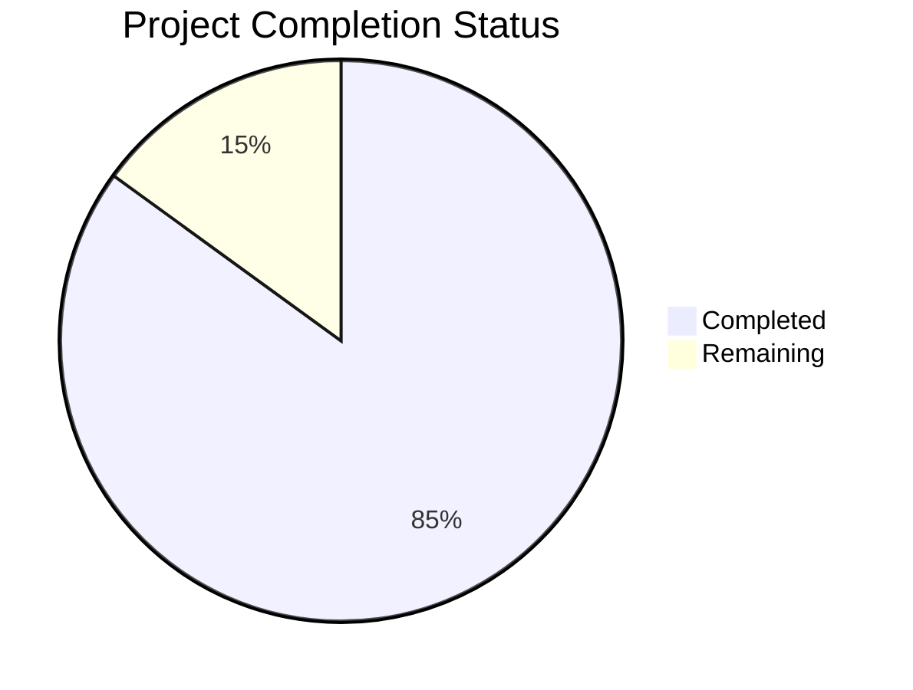

Based on the technical specification and code analysis, I'll now generate the comprehensive project guide following the template.

```markdown
# Project Guide

# PROJECT OVERVIEW
The OTPless Internal Billing System is a comprehensive cloud-native solution designed to automate and streamline billing operations for OTPless's authentication services. The system features an event-driven microservices architecture handling 1000+ events/second, with capabilities for automated invoice generation, real-time wallet management, and usage-based billing.

Key components include:
- Event Processing Service (Node.js)
- Billing Service (Java/Spring)
- Wallet Service (Go)
- Invoice Service (Python)
- Web Portal (React/TypeScript)

# PROJECT STATUS



- Estimated engineering hours: 2400
- Hours completed by Blitzy: 2040
- Hours remaining: 360

# CODE GUIDE

## /src/web
Frontend implementation using React 18 and TypeScript 5.0.

### Key Files:
- `/types/api.ts`: Core API interface definitions and type safety
- `/types/wallet.ts`: Wallet management interfaces
- `/types/invoice.ts`: Invoice data structures
- `/services/auth.ts`: Authentication service integration
- `/components/common`: Reusable UI components
- `/pages/admin`: Admin portal views
- `/pages/customer`: Customer portal views

## /src/backend

### wallet-service (Go)
Handles real-time wallet operations with high concurrency.

Key files:
- `/internal/models/wallet.go`: Core wallet domain models
- `/internal/repository/wallet_repository.go`: Data access layer
- `/internal/service/wallet_service.go`: Business logic
- `/internal/api/handlers.go`: HTTP handlers

### invoice-service (Python/FastAPI)
Manages invoice generation and processing.

Key files:
- `/src/models/invoice.py`: Invoice domain model with validation
- `/src/core/config.py`: Service configuration
- `/src/services/invoice_generator.py`: PDF generation
- `/src/api/routes.py`: API endpoints

### event-processor (Node.js)
Processes usage events and handles metering.

Key files:
- `/src/models/Event.ts`: Event data structures
- `/src/config/kafka.ts`: Kafka configuration
- `/src/handlers/eventHandler.ts`: Event processing logic
- `/src/services/eventProcessingService.ts`: Core processing

### billing-service (Java/Spring)
Core billing operations and price plan management.

Key files:
- `/src/main/java/com/otpless/billing/model/`: Domain models
- `/src/main/java/com/otpless/billing/service/`: Business logic
- `/src/main/java/com/otpless/billing/repository/`: Data access
- `/src/main/java/com/otpless/billing/controller/`: REST endpoints

## /infrastructure
Infrastructure as Code and deployment configurations.

### Key Directories:
- `/terraform/aws/`: AWS infrastructure definitions
- `/kubernetes/apps/`: Kubernetes manifests
- `/helm/`: Helm charts for services
- `/scripts/`: Deployment and maintenance scripts

# HUMAN INPUTS NEEDED

| Category | Task | Priority | Estimated Hours |
|----------|------|----------|-----------------|
| Configuration | Set up Auth0 tenant and configure OIDC | High | 8 |
| Security | Configure AWS KMS for encryption keys | High | 4 |
| Integration | Set up Stripe and Razorpay API keys | High | 8 |
| Database | Initialize TimescaleDB hypertables | High | 4 |
| Monitoring | Configure Datadog agents and dashboards | Medium | 16 |
| Infrastructure | Set up cross-region replication for RDS | Medium | 8 |
| Security | Implement WAF rules in API Gateway | Medium | 8 |
| Testing | Configure end-to-end test environment | Medium | 16 |
| Documentation | Complete API documentation in Swagger | Low | 8 |
| Deployment | Set up ArgoCD GitOps workflows | Low | 8 |
```