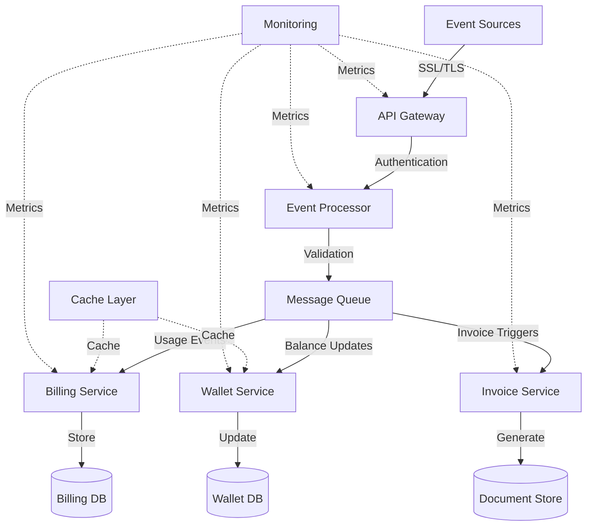

# Technical Specifications

# 1. INTRODUCTION

## 1.1 EXECUTIVE SUMMARY

The OTPless Internal Billing System is a comprehensive solution designed to automate and streamline billing operations for OTPless's authentication services. The system addresses the critical need for accurate, scalable, and automated billing by processing usage events, managing customer price plans, generating invoices, and handling prepaid wallet operations.

This system will serve finance, engineering, and product teams by providing automated invoice generation, API-first metering services, and data-driven pricing insights. The expected impact includes reduced manual intervention, zero billing errors, improved revenue capture, and enhanced operational efficiency through real-time analytics and automated workflows.

## 1.2 SYSTEM OVERVIEW

### Project Context

| Aspect | Description |
| --- | --- |
| Business Context | Core revenue management system for OTPless's authentication platform |
| Current Limitations | Manual invoice generation, delayed usage tracking, limited pricing flexibility |
| Enterprise Integration | Interfaces with OTPless core authentication, payment gateways (Stripe/Razorpay), and internal analytics |

### High-Level Description

The system implements a modern, cloud-native architecture featuring:

- Event-driven processing pipeline handling 1000+ events/second
- Multi-tenant data architecture with strict isolation
- Microservices-based design for scalability and maintainability
- Real-time processing for prepaid wallet management
- REST APIs for internal and external consumption

### Success Criteria

| Category | Metrics |
| --- | --- |
| Performance | - Event processing latency ≤ 100ms<br>- 99.9% system uptime<br>- Zero revenue leakage |
| Business Impact | - 100% automation of invoice generation<br>- 90% reduction in manual interventions<br>- Real-time usage visibility |
| Technical Excellence | - 100% API coverage for features<br>- ≤ 0.01% error rate in billing calculations<br>- 100% audit trail coverage |

## 1.3 SCOPE

### In-Scope Elements

#### Core Features and Functionalities

| Component | Capabilities |
| --- | --- |
| Event Processing | - Real-time usage metering<br>- Idempotent event handling<br>- Usage aggregation |
| Billing Operations | - Automated invoice generation<br>- Tax calculations (GST/IGST)<br>- Payment processing |
| Wallet Management | - Real-time balance updates<br>- Auto-deductions<br>- Low balance alerting |
| Price Management | - Flexible plan configuration<br>- Custom contract support<br>- Version control |

#### Implementation Boundaries

| Boundary Type | Coverage |
| --- | --- |
| User Groups | - Finance team<br>- Engineering team<br>- Product team<br>- External customers |
| Geographic Coverage | - India (primary)<br>- International markets (USD/IDR support) |
| Data Domains | - Usage data<br>- Customer profiles<br>- Financial transactions<br>- Pricing configurations |

### Out-of-Scope Elements

- General ledger accounting and financial reporting
- Payment gateway implementation (using existing integrations)
- Customer authentication (handled by OTPless core)
- Tax filing and regulatory reporting
- Historical data migration from legacy systems
- Custom payment gateway development
- Financial forecasting and budgeting tools
- Customer relationship management (CRM) features

# 2. SYSTEM ARCHITECTURE

## 2.1 High-Level Architecture

The OTPless Internal Billing System follows a microservices architecture pattern with event-driven communication for scalability and maintainability.

### 2.1.1 System Context Diagram (Level 0)


### 2.1.2 Container Diagram (Level 1)


## 2.2 Component Details

### 2.2.1 Core Components

| Component | Purpose | Technology Stack | Scaling Strategy |
| --- | --- | --- | --- |
| API Gateway | Request routing, authentication | AWS API Gateway,nginx | Horizontal scaling with load balancer |
| Event Processor | Usage event handling | Node.js, Kafka Streams | Auto-scaling based on queue length |
| Billing Service | Core billing operations | Java, Spring Boot | Horizontal scaling with state replication |
| Wallet Service | Balance management | Go, gRPC | Horizontal scaling with distributed locking |
| Invoice Service | Invoice generation | Python, FastAPI | Auto-scaling based on queue length |

### 2.2.2 Data Flow Diagram



## 2.3 Technical Decisions

### 2.3.1 Architecture Patterns

| Pattern | Implementation | Justification |
| --- | --- | --- |
| Microservices | Domain-driven service boundaries | Enables independent scaling and deployment |
| Event-Driven | Kafka-based event streaming | Handles high-volume usage events efficiently |
| CQRS | Separate read/write models | Optimizes for different query patterns |
| Circuit Breaker | Resilience4j implementation | Prevents cascade failures |

### 2.3.2 Data Storage Solutions

| Data Type | Storage Solution | Justification |
| --- | --- | --- |
| Usage Events | TimescaleDB | Optimized for time-series data |
| Billing Data | PostgreSQL | ACID compliance for financial data |
| Cache Data | Redis Cluster | High-performance distributed caching |
| Documents | MinIO | Scalable object storage for invoices |

## 2.4 Cross-Cutting Concerns

### 2.4.1 Deployment Diagram


### 2.4.2 Monitoring and Observability

| Component | Implementation | Purpose |
| --- | --- | --- |
| Metrics | Prometheus + Grafana | Real-time system metrics |
| Logging | ELK Stack | Centralized log management |
| Tracing | Jaeger | Distributed request tracing |
| Alerting | PagerDuty | Incident management |

### 2.4.3 Security Architecture


## 2.5 Performance Requirements

| Metric | Requirement | Implementation |
| --- | --- | --- |
| Latency | ≤ 100ms for API requests | - CDN for static content<br>- Redis caching<br>- Query optimization |
| Throughput | 1000+ events/second | - Horizontal scaling<br>- Event batching<br>- Async processing |
| Availability | 99.9% uptime | - Multi-AZ deployment<br>- Automated failover<br>- Load balancing |
| Recovery | RTO: 4 hours, RPO: 15 min | - Regular backups<br>- Disaster recovery plan<br>- Automated recovery |

# 3. SYSTEM COMPONENTS ARCHITECTURE

## 3.1 USER INTERFACE DESIGN

### 3.1.1 Design Specifications

| Aspect | Requirements |
| --- | --- |
| Visual Hierarchy | - Material Design 3.0 principles<br>- Consistent typography scale<br>- 8px grid system |
| Component Library | - MUI v5 as base library<br>- Custom themed components<br>- Shared design tokens |
| Responsive Design | - Mobile-first approach<br>- Breakpoints: 320px, 768px, 1024px, 1440px<br>- Fluid typography |
| Accessibility | - WCAG 2.1 Level AA compliance<br>- ARIA landmarks<br>- Keyboard navigation support |
| Browser Support | - Chrome (latest 2 versions)<br>- Firefox (latest 2 versions)<br>- Safari (latest 2 versions)<br>- Edge (latest version) |
| Theme Support | - Light/Dark mode toggle<br>- System preference detection<br>- Persistent user preference |
| i18n Support | - RTL layout support<br>- Multi-currency display<br>- DateTime localization |

### 3.1.2 Interface Elements


#### Critical User Flows


### 3.1.3 Form Validation Rules

| Field Type | Validation Rules |
| --- | --- |
| Email | - RFC 5322 standard<br>- Maximum 254 characters<br>- Required field |
| Phone | - E.164 format<br>- Country code required<br>- Optional field |
| Currency | - 2 decimal places<br>- Positive values only<br>- Required for transactions |
| Dates | - ISO 8601 format<br>- Future dates for plans<br>- Past dates for invoices |

## 3.2 DATABASE DESIGN

### 3.2.1 Schema Design


### 3.2.2 Data Management Strategy

| Aspect | Implementation |
| --- | --- |
| Partitioning | - Time-based partitioning for events<br>- Hash partitioning for large tables<br>- Range partitioning for historical data |
| Indexing | - B-tree indexes for lookups<br>- GiST indexes for JSON<br>- Partial indexes for active records |
| Archival | - Monthly archival process<br>- Cold storage after 12 months<br>- Compliance-based retention |
| Audit Logging | - CDC for critical tables<br>- Temporal tables for history<br>- Immutable audit records |

### 3.2.3 Performance Optimization

| Strategy | Implementation |
| --- | --- |
| Caching | - Redis for hot data<br>- Materialized views for reports<br>- Query result cache |
| Replication | - Multi-AZ deployment<br>- Read replicas for reporting<br>- Async replication |
| Backup | - Point-in-time recovery<br>- Cross-region backups<br>- 30-day retention |

## 3.3 API DESIGN

### 3.3.1 API Architecture


### 3.3.2 Interface Specifications

| Endpoint Category | Base Path | Version Strategy |
| --- | --- | --- |
| Customer API | /api/customers | URI versioning (v1, v2) |
| Billing API | /api/billing | Header versioning |
| Usage API | /api/usage | Query param versioning |
| Admin API | /api/admin | URI versioning |

### 3.3.3 Integration Requirements

| Integration Type | Requirements |
| --- | --- |
| Authentication | - OAuth 2.0 / JWT<br>- API key support<br>- Rate limiting per key |
| Gateway | - Kong API Gateway<br>- Custom plugins<br>- Traffic management |
| Service Discovery | - Kubernetes native<br>- Health checks<br>- Circuit breakers |

### 3.3.4 API Security Controls

| Control | Implementation |
| --- | --- |
| Authentication | - JWT with RSA-256<br>- Token expiration<br>- Refresh token rotation |
| Authorization | - RBAC with custom claims<br>- Scope-based access<br>- Resource-level permissions |
| Rate Limiting | - 1000 req/min per IP<br>- 10000 req/min per API key<br>- Burst allowance |
| Input Validation | - JSON Schema validation<br>- Request size limits<br>- Content type enforcement |

# 4. TECHNOLOGY STACK

## 4.1 PROGRAMMING LANGUAGES

| Platform/Component | Language & Version | Justification |
| --- | --- | --- |
| Event Processing | Node.js v18 LTS | - High throughput event handling<br>- Non-blocking I/O<br>- Rich ecosystem for event streaming |
| Core Billing Service | Java 17 | - Strong typing for financial calculations<br>- Enterprise-grade reliability<br>- Mature ecosystem for financial systems |
| Wallet Service | Go 1.20 | - High performance for real-time operations<br>- Excellent concurrency handling<br>- Low latency requirements |
| Invoice Generation | Python 3.11 | - Rich PDF generation libraries<br>- Data processing capabilities<br>- Integration flexibility |
| Web Interface | TypeScript 5.0 | - Type safety for complex UI states<br>- Enhanced developer productivity<br>- Better maintainability |

## 4.2 FRAMEWORKS & LIBRARIES

### Backend Frameworks

| Component | Framework | Version | Justification |
| --- | --- | --- | --- |
| Event Processing | NestJS | 10.x | - Enterprise-grade architecture<br>- Built-in dependency injection<br>- TypeScript support |
| Billing Service | Spring Boot | 3.1.x | - Production-proven for financial systems<br>- Comprehensive security features<br>- Transaction management |
| Wallet Service | Gin | 1.9.x | - High-performance HTTP framework<br>- Middleware support<br>- Easy integration with Go ecosystem |
| Invoice Service | FastAPI | 0.100.x | - Async support<br>- OpenAPI documentation<br>- High performance |

### Frontend Frameworks

| Component | Framework | Version | Justification |
| --- | --- | --- | --- |
| Admin Portal | React | 18.x | - Component reusability<br>- Virtual DOM performance<br>- Rich ecosystem |
| UI Components | MUI | 5.x | - Enterprise-ready components<br>- Customization options<br>- Accessibility compliance |
| State Management | Redux Toolkit | 1.9.x | - Predictable state management<br>- DevTools integration<br>- Middleware support |

## 4.3 DATABASES & STORAGE


| Storage Type | Technology | Purpose | Justification |
| --- | --- | --- | --- |
| Primary Database | PostgreSQL 15 | Core business data | - ACID compliance<br>- Complex query support<br>- Mature replication |
| Time Series | TimescaleDB | Usage events | - Optimized for time-series<br>- SQL interface<br>- Efficient aggregations |
| Cache | Redis Cluster 7.0 | Application cache | - High performance<br>- Distributed locking<br>- Pub/sub support |
| Document Store | MinIO | Invoice storage | - S3-compatible API<br>- On-premise capability<br>- Cost-effective |

## 4.4 THIRD-PARTY SERVICES

| Category | Service | Purpose | Integration Method |
| --- | --- | --- | --- |
| Payment Processing | Stripe API v2023-10 | Payment handling | REST API with webhooks |
| Payment Processing | Razorpay v1 | Regional payments | REST API with webhooks |
| Authentication | Auth0 | User authentication | OAuth 2.0 / OIDC |
| Monitoring | Datadog | System monitoring | Agent-based + API |
| Error Tracking | Sentry | Error monitoring | SDK integration |
| Email Service | AWS SES | Notification delivery | SMTP / API |

## 4.5 DEVELOPMENT & DEPLOYMENT


### Development Tools

| Category | Tool | Version | Purpose |
| --- | --- | --- | --- |
| IDE | VSCode | Latest | Primary development environment |
| Version Control | Git | Latest | Source code management |
| API Testing | Postman | Latest | API development and testing |
| Container Runtime | Docker | 24.x | Local development |

### Build & Deployment

| Component | Technology | Version | Purpose |
| --- | --- | --- | --- |
| Container Runtime | Docker | 24.x | Application containerization |
| Container Orchestration | Kubernetes | 1.27.x | Production deployment |
| Infrastructure as Code | Terraform | 1.5.x | Infrastructure provisioning |
| CI/CD | GitHub Actions | N/A | Automated pipeline |
| GitOps | ArgoCD | 2.8.x | Kubernetes deployment |

# 5. SYSTEM DESIGN

## 5.1 USER INTERFACE DESIGN

### 5.1.1 Admin Portal Layout


### 5.1.2 Key Interface Components

| Component | Description | Key Features |
| --- | --- | --- |
| Dashboard | Overview screen | - Usage metrics cards<br>- Revenue charts<br>- Alert notifications |
| Customer Management | Customer data grid | - Search and filters<br>- Bulk actions<br>- Inline editing |
| Billing Console | Invoice management | - Invoice generation<br>- Payment tracking<br>- Price plan assignment |
| Wallet Management | Balance tracking | - Real-time updates<br>- Transaction history<br>- Top-up interface |

### 5.1.3 Responsive Breakpoints

| Breakpoint | Width | Layout Adjustments |
| --- | --- | --- |
| Mobile | \< 768px | - Stack navigation<br>- Hide sidebar<br>- Simplified grids |
| Tablet | 768px - 1024px | - Compact navigation<br>- Collapsible sidebar<br>- Responsive grids |
| Desktop | \> 1024px | - Full navigation<br>- Expanded sidebar<br>- Full feature set |

## 5.2 DATABASE DESIGN

### 5.2.1 Schema Overview


### 5.2.2 Table Structures

| Table | Primary Purpose | Storage Engine | Partitioning Strategy |
| --- | --- | --- | --- |
| customers | Core customer data | InnoDB | None |
| accounts | Account management | InnoDB | None |
| usage_events | Usage tracking | TimescaleDB | Time-based |
| wallets | Balance management | InnoDB | None |
| invoices | Billing records | InnoDB | Range by date |
| payments | Transaction records | InnoDB | Range by date |

### 5.2.3 Indexing Strategy

| Table | Index Type | Columns | Purpose |
| --- | --- | --- | --- |
| usage_events | Time-based | (account_id, timestamp) | Event querying |
| wallets | B-tree | (account_id, updated_at) | Balance lookup |
| invoices | Composite | (account_id, status, due_date) | Invoice filtering |
| payments | B-tree | (invoice_id, status) | Payment tracking |

## 5.3 API DESIGN

### 5.3.1 API Architecture


### 5.3.2 Core API Endpoints

| Endpoint | Method | Purpose | Rate Limit |
| --- | --- | --- | --- |
| /api/v1/events | POST | Ingest usage events | 1000/sec |
| /api/v1/invoices | GET/POST | Invoice management | 100/min |
| /api/v1/wallets | GET/PATCH | Wallet operations | 500/min |
| /api/v1/pricing | GET/POST | Price plan management | 100/min |

### 5.3.3 API Security Controls

| Control | Implementation | Purpose |
| --- | --- | --- |
| Authentication | JWT with RSA-256 | Identity verification |
| Rate Limiting | Token bucket | Prevent abuse |
| Input Validation | JSON Schema | Data integrity |
| CORS | Whitelist based | Cross-origin security |

### 5.3.4 Response Formats

```json
{
  "status": "success",
  "data": {
    "id": "uuid",
    "type": "resource_type",
    "attributes": {},
    "relationships": {}
  },
  "meta": {
    "timestamp": "iso8601",
    "version": "1.0"
  }
}
```

### 5.3.5 Error Handling

| Error Category | HTTP Status | Response Format |
| --- | --- | --- |
| Validation | 400 | Detailed field errors |
| Authentication | 401 | Auth failure reason |
| Authorization | 403 | Permission details |
| Resource | 404 | Resource identifier |
| System | 500 | Error reference ID |

# 6. USER INTERFACE DESIGN

## 6.1 Overview

The system requires both an administrative portal and a customer portal interface built using React and Material UI v5.

## 6.2 Common UI Elements Key

```
Icons:
[?] - Help/Documentation
[$] - Financial/Payment related
[i] - Information tooltip
[+] - Add new/Create
[x] - Close/Delete/Remove
[<] [>] - Navigation/Pagination
[^] - Upload/Import
[#] - Dashboard/Menu
[@] - User profile
[!] - Alert/Warning
[=] - Settings menu
[*] - Favorite/Important

Interactive Elements:
[ ] - Checkbox
( ) - Radio button
[Button] - Clickable button
[...] - Text input field
[====] - Progress bar
[v] - Dropdown menu

Layout:
+--+ - Container border
|  | - Vertical separator
+-- - Tree view/hierarchy
```

## 6.3 Administrative Portal Wireframes

### 6.3.1 Dashboard

```
+--------------------------------------------------------------+
|  [#] OTPless Billing Admin    [@] Admin User    [?] Help [=]  |
+--------------------------------------------------------------+
|                                                              |
|  Revenue Overview                     Quick Actions          |
|  +------------------------+          +-----------------+      |
|  |  Total Revenue        |          | [+] New Customer|      |
|  |  [$] 125,000 USD      |          | [+] New Invoice |      |
|  |  [====] +15% MTD      |          | [^] Import Data |      |
|  +------------------------+          +-----------------+      |
|                                                              |
|  Active Customers         Pending Invoices    Wallet Alerts  |
|  +---------------+        +--------------+    +------------+ |
|  | [@] 150       |        | [$] 25       |    | [!] 10     | |
|  | [====] 98%    |        | $45,000 USD  |    | Low Balance| |
|  +---------------+        +--------------+    +------------+ |
|                                                              |
|  Recent Activity                                             |
|  +------------------------------------------------------+  |
|  | [*] New customer onboarded - Acme Corp                |  |
|  | [$] Invoice #1234 paid - $5,000                       |  |
|  | [!] Low wallet balance - Customer #5678               |  |
|  | [i] Price plan updated - Enterprise Plan v2           |  |
|  +------------------------------------------------------+  |
+--------------------------------------------------------------+
```

### 6.3.2 Customer Management

```
+--------------------------------------------------------------+
|  [<] Back to Dashboard                        [@] Admin [=]    |
+--------------------------------------------------------------+
|  Customer Management                    [+] Add New Customer   |
|                                                               |
|  Search: [...........................] [Button: Search]        |
|                                                               |
|  Filters: Status [v] Plan Type [v] Country [v] [Button: Apply]|
|                                                               |
|  +--------------------------------------------------------+ |
|  | Name         | Plan     | Wallet Balance | Status    |   | |
|  |--------------------------------------------------------| |
|  | Acme Corp    | Pro      | [$] 5,000      | [*] Active |   | |
|  | Beta Inc     | Standard | [$] 500        | [!] Low    |   | |
|  | Cloud Ltd    | Custom   | [$] 25,000     | [*] Active |   | |
|  +--------------------------------------------------------+ |
|                                                               |
|  [<] 1 2 3 ... 10 [>]                    Showing 1-3 of 150  |
+--------------------------------------------------------------+
```

### 6.3.3 Invoice Generation

```
+--------------------------------------------------------------+
|  [<] Back to Customers                       [@] Admin [=]     |
+--------------------------------------------------------------+
|  Generate Invoice - Acme Corp                                  |
|                                                               |
|  Billing Period:                                              |
|  Start Date: [.../..../....] End Date: [.../..../....]       |
|                                                               |
|  Line Items:                                                  |
|  +--------------------------------------------------------+ |
|  | Service          | Usage     | Rate          | Amount   | |
|  |--------------------------------------------------------| |
|  | Authentication   | 10,000    | $0.01/call    | $100.00  | |
|  | [+] Add Line Item                                       | |
|  +--------------------------------------------------------+ |
|                                                               |
|  Subtotal:                                         $100.00    |
|  Tax (18%):                                        $18.00     |
|  Total:                                            $118.00    |
|                                                               |
|  [Button: Preview] [Button: Generate] [Button: Cancel]        |
+--------------------------------------------------------------+
```

## 6.4 Customer Portal Wireframes

### 6.4.1 Customer Dashboard

```
+--------------------------------------------------------------+
|  [#] OTPless Billing Portal         [@] Customer     [?]      |
+--------------------------------------------------------------+
|                                                               |
|  Wallet Balance                     Quick Actions             |
|  +------------------------+         +------------------+       |
|  |  [$] 5,000 USD        |         | [+] Top Up       |       |
|  |  [!] Low Balance      |         | [$] Pay Invoice  |       |
|  +------------------------+         +------------------+       |
|                                                               |
|  Usage Overview                     Recent Invoices           |
|  +------------------------+         +------------------+       |
|  |  This Month           |         | #1234 $500 [Paid]|       |
|  |  Calls: 50,000        |         | #1233 $750 [Due] |       |
|  |  [====] 75% of limit  |         | #1232 $600 [Paid]|       |
|  +------------------------+         +------------------+       |
|                                                               |
|  Alerts & Notifications                                       |
|  +------------------------------------------------------+   |
|  | [!] Wallet balance below threshold                    |   |
|  | [i] New invoice generated #1234                       |   |
|  | [i] Price plan update effective from next month       |   |
|  +------------------------------------------------------+   |
+--------------------------------------------------------------+
```

### 6.4.2 Usage Analytics

```
+--------------------------------------------------------------+
|  [<] Back to Dashboard                    [@] Customer [=]     |
+--------------------------------------------------------------+
|  Usage Analytics                    Time Period [v] Last 30D   |
|                                                               |
|  +--------------------------------------------------------+ |
|  |  Daily Usage Trend                                       | |
|  |                                                          | |
|  |  ^                                                       | |
|  |  |    *   *                                             | |
|  |  |  * * * * *   *                                       | |
|  |  | * * * * * * * *                                      | |
|  |  +------------------------------------------------     | |
|  |                     Time →                              | |
|  +--------------------------------------------------------+ |
|                                                               |
|  Usage Breakdown                                              |
|  +--------------------------------------------------------+ |
|  | Channel      | Calls    | Cost          | % of Total    | |
|  |--------------------------------------------------------| |
|  | SMS          | 30,000   | $300          | 60%           | |
|  | WhatsApp     | 15,000   | $150          | 30%           | |
|  | Email        | 5,000    | $50           | 10%           | |
|  +--------------------------------------------------------+ |
+--------------------------------------------------------------+
```

## 6.5 Responsive Design Breakpoints

| Breakpoint | Width | Layout Adjustments |
| --- | --- | --- |
| Mobile | \< 768px | Single column, stacked components |
| Tablet | 768px - 1024px | Two column layout |
| Desktop | \> 1024px | Full three column layout |

## 6.6 Theme Specifications

| Element | Light Theme | Dark Theme |
| --- | --- | --- |
| Background | #FFFFFF | #121212 |
| Primary Text | #333333 | #FFFFFF |
| Secondary Text | #666666 | #AAAAAA |
| Primary Action | #1976D2 | #90CAF9 |
| Alert | #F44336 | #EF5350 |
| Success | #4CAF50 | #66BB6A |
| Warning | #FFC107 | #FFCA28 |

# 7. SECURITY CONSIDERATIONS

## 7.1 AUTHENTICATION AND AUTHORIZATION

### 7.1.1 Authentication Methods

| Method | Implementation | Use Case |
| --- | --- | --- |
| OAuth 2.0 + OIDC | Auth0 integration | Web portal access |
| API Keys | HMAC-SHA256 signed | API authentication |
| JWT | RS256 algorithm | Service-to-service |
| MFA | TOTP/SMS via Auth0 | Admin portal access |

### 7.1.2 Authorization Model


### 7.1.3 Permission Matrix

| Role | Billing Operations | Customer Management | Usage Data | Wallet Management |
| --- | --- | --- | --- | --- |
| Super Admin | Full Access | Full Access | Full Access | Full Access |
| Finance Admin | Full Access | Read/Write | Read Only | Full Access |
| Support User | Read Only | Read Only | Read Only | Read Only |
| Customer | Own Data Only | Own Profile Only | Own Usage Only | Own Wallet Only |

## 7.2 DATA SECURITY

### 7.2.1 Data Classification

| Classification | Examples | Security Controls |
| --- | --- | --- |
| Critical | Payment Data, API Keys | - HSM storage<br>- Field-level encryption<br>- Audit logging |
| Sensitive | Customer PII, Wallet Balances | - AES-256 encryption<br>- Access controls<br>- Data masking |
| Internal | Usage Data, Invoices | - TLS encryption<br>- Role-based access<br>- Backup encryption |
| Public | Price Plans, API Docs | - Integrity checks<br>- Version control<br>- CDN protection |

### 7.2.2 Encryption Architecture


### 7.2.3 Data Protection Measures

| Layer | Protection Mechanism | Implementation |
| --- | --- | --- |
| Application | Input Validation | - Schema validation<br>- Sanitization<br>- Parameter binding |
| Transport | TLS 1.3 | - Perfect forward secrecy<br>- Strong cipher suites<br>- Certificate pinning |
| Database | Encryption at Rest | - Transparent data encryption<br>- Encrypted backups<br>- Secure key rotation |
| Infrastructure | Network Security | - VPC isolation<br>- Security groups<br>- WAF protection |

## 7.3 SECURITY PROTOCOLS

### 7.3.1 Access Control Protocol


### 7.3.2 Security Monitoring

| Component | Monitoring Approach | Alert Triggers |
| --- | --- | --- |
| API Gateway | - Request rate monitoring<br>- Error rate tracking<br>- Latency analysis | - Unusual traffic patterns<br>- High error rates<br>- Slow response times |
| Authentication | - Failed login attempts<br>- Token usage patterns<br>- MFA failures | - Brute force attempts<br>- Token theft indicators<br>- Geographic anomalies |
| Data Access | - Sensitive data access logs<br>- Modification tracking<br>- Export monitoring | - Unusual access patterns<br>- Bulk exports<br>- Off-hours activity |

### 7.3.3 Security Compliance Requirements

| Standard | Requirements | Implementation |
| --- | --- | --- |
| PCI DSS | - Secure card data handling<br>- Access control<br>- Encryption standards | - Payment gateway integration<br>- Role-based access<br>- TLS 1.3 encryption |
| ISO 27001 | - Information security controls<br>- Risk management<br>- Security monitoring | - Security policies<br>- Risk assessments<br>- Continuous monitoring |
| GDPR | - Data protection<br>- Privacy controls<br>- Data subject rights | - Data encryption<br>- Consent management<br>- Access controls |

### 7.3.4 Incident Response Protocol

| Phase | Actions | Responsibilities |
| --- | --- | --- |
| Detection | - Automated monitoring<br>- Alert correlation<br>- Threat intelligence | Security Team |
| Analysis | - Impact assessment<br>- Scope determination<br>- Evidence collection | Security + Engineering |
| Containment | - Threat isolation<br>- Access revocation<br>- System hardening | Engineering Team |
| Recovery | - Service restoration<br>- Data validation<br>- Security verification | Operations Team |
| Post-Incident | - Root cause analysis<br>- Process improvement<br>- Documentation update | All Teams |

# 8. INFRASTRUCTURE

## 8.1 DEPLOYMENT ENVIRONMENT

The OTPless Internal Billing System utilizes a cloud-native architecture deployed on AWS with multi-region failover capabilities.

### 8.1.1 Environment Overview

| Environment | Purpose | Configuration |
| --- | --- | --- |
| Development | Feature development and testing | Single region, scaled-down resources |
| Staging | Pre-production testing and integration | Multi-AZ, production-like setup |
| Production | Live system serving customers | Multi-region, fully redundant |
| DR | Disaster recovery standby | Cross-region replication |

### 8.1.2 Production Architecture


## 8.2 CLOUD SERVICES

### 8.2.1 AWS Services Selection

| Service | Usage | Justification |
| --- | --- | --- |
| EKS | Container orchestration | Native Kubernetes support with AWS integration |
| RDS | Database hosting | Managed PostgreSQL with automatic failover |
| ElastiCache | Caching layer | Managed Redis with cluster mode |
| S3 | Object storage | Scalable storage for invoices and documents |
| CloudFront | CDN | Global content delivery and DDoS protection |
| Route53 | DNS management | Global DNS with health checking |
| KMS | Key management | FIPS 140-2 compliant encryption key management |
| Secrets Manager | Secrets management | Secure credential rotation and distribution |

### 8.2.2 Multi-Region Architecture


## 8.3 CONTAINERIZATION

### 8.3.1 Container Strategy

| Component | Base Image | Resource Limits |
| --- | --- | --- |
| API Gateway | nginx:alpine | CPU: 1, Memory: 2Gi |
| Event Processor | node:18-alpine | CPU: 2, Memory: 4Gi |
| Billing Service | amazoncorretto:17-alpine | CPU: 2, Memory: 6Gi |
| Wallet Service | golang:1.20-alpine | CPU: 1, Memory: 2Gi |
| Invoice Service | python:3.11-slim | CPU: 1, Memory: 2Gi |

### 8.3.2 Container Security

| Security Layer | Implementation |
| --- | --- |
| Image Scanning | Trivy for vulnerability scanning |
| Runtime Security | Falco for runtime protection |
| Access Control | AWS ECR with RBAC |
| Network Policy | Calico network policies |

## 8.4 ORCHESTRATION

### 8.4.1 Kubernetes Architecture


### 8.4.2 Kubernetes Resources

| Resource Type | Purpose | Configuration |
| --- | --- | --- |
| Deployments | Application workloads | Rolling updates, auto-scaling |
| StatefulSets | Stateful components | Ordered deployment, stable storage |
| Services | Internal networking | Load balancing, service discovery |
| Ingress | External access | TLS termination, routing rules |
| ConfigMaps | Configuration | Environment-specific settings |
| Secrets | Sensitive data | Encrypted storage, automatic rotation |

## 8.5 CI/CD PIPELINE

### 8.5.1 Pipeline Architecture

```mermaid
flowchart LR
    subgraph "Source"
        GIT[GitHub]
    end
    
    subgraph "Build"
        ACTIONS[GitHub Actions]
        DOCKER[Docker Build]
        TEST[Unit Tests]
    end
    
    subgraph "Quality"
        SONAR[SonarQube]
        SEC[Security Scan]
    end
    
    subgraph "Deploy"
        ARGO[ArgoCD]
        HELM[Helm Charts]
    end
    
    GIT --> ACTIONS
    ACTIONS --> DOCKER
    ACTIONS --> TEST
    TEST --> SONAR
    DOCKER --> SEC
    SEC --> ARGO
    HELM --> ARGO
```

### 8.5.2 Pipeline Stages

| Stage | Tools | Purpose |
| --- | --- | --- |
| Source Control | GitHub | Version control and collaboration |
| Build | GitHub Actions | Automated build and testing |
| Security | Trivy, SonarQube | Vulnerability and code quality scanning |
| Artifact Storage | AWS ECR | Container image registry |
| Configuration | Helm | Application configuration management |
| Deployment | ArgoCD | GitOps-based deployment |
| Monitoring | Prometheus, Grafana | Performance and health monitoring |

### 8.5.3 Deployment Strategy

| Environment | Strategy | Rollback Plan |
| --- | --- | --- |
| Development | Direct deployment | Manual rollback |
| Staging | Blue-green deployment | Automatic rollback on health check failure |
| Production | Canary deployment | Automated rollback with traffic shifting |
| DR | Automated failover | Cross-region recovery procedure |

# 9. APPENDICES

## 9.1 ADDITIONAL TECHNICAL INFORMATION

### 9.1.1 Event Processing Pipeline Details

```mermaid
flowchart TD
    A[Event Source] -->|SSL/TLS| B[Kong API Gateway]
    B -->|JWT Validation| C[Event Validator]
    C -->|Valid Event| D[Kafka Producer]
    D -->|Topic: raw-events| E[Kafka Cluster]
    
    E -->|Consumer Group 1| F[Event Processor]
    E -->|Consumer Group 2| G[Analytics Processor]
    
    F -->|Processed Events| H[(TimescaleDB)]
    G -->|Aggregated Data| I[(ClickHouse)]
    
    J[Dead Letter Queue] -.->|Failed Events| K[Error Handler]
    K -->|Retry Logic| D
```

### 9.1.2 Wallet Transaction States

| State | Description | Next Possible States | Actions |
| --- | --- | --- | --- |
| INITIATED | Transaction created | PROCESSING, FAILED | Lock wallet balance |
| PROCESSING | Payment in progress | COMPLETED, FAILED | Update gateway status |
| COMPLETED | Transaction successful | - | Release/Update balance |
| FAILED | Transaction failed | INITIATED | Release locks, notify |
| REVERSED | Transaction reversed | COMPLETED | Adjust balance |

### 9.1.3 Cache Strategy

| Data Type | Cache Layer | TTL | Invalidation Strategy |
| --- | --- | --- | --- |
| Price Plans | Redis | 1 hour | On update |
| Wallet Balance | Redis | 30 seconds | On transaction |
| Usage Metrics | Redis | 5 minutes | Rolling window |
| Customer Profile | Redis | 15 minutes | On modification |

## 9.2 GLOSSARY

| Term | Definition |
| --- | --- |
| Aggregation Window | Time period for grouping usage events for billing |
| Blue-Green Deployment | Deployment strategy using two identical environments |
| Circuit Breaker | Design pattern preventing cascading failures |
| Dead Letter Queue | Storage for failed message processing |
| Eventual Consistency | Data consistency model allowing temporary inconsistencies |
| Idempotency Key | Unique identifier ensuring operation uniqueness |
| Rate Limiting | Controlling request frequency to an API |
| Rolling Update | Gradual deployment of new versions |
| Sharding | Database partitioning for scalability |
| Tenant | Individual customer organization in multi-tenant system |
| Throttling | Controlling resource usage rate |
| Webhook | HTTP callback for event notifications |

## 9.3 ACRONYMS

| Acronym | Full Form |
| --- | --- |
| AES | Advanced Encryption Standard |
| API | Application Programming Interface |
| AWS | Amazon Web Services |
| CDC | Change Data Capture |
| CDN | Content Delivery Network |
| CQRS | Command Query Responsibility Segregation |
| DDoS | Distributed Denial of Service |
| EKS | Elastic Kubernetes Service |
| FIPS | Federal Information Processing Standards |
| gRPC | Google Remote Procedure Call |
| HMAC | Hash-based Message Authentication Code |
| HSM | Hardware Security Module |
| OIDC | OpenID Connect |
| RBAC | Role-Based Access Control |
| RDS | Relational Database Service |
| REST | Representational State Transfer |
| SDK | Software Development Kit |
| SES | Simple Email Service |
| SSL | Secure Sockets Layer |
| TLS | Transport Layer Security |
| VPC | Virtual Private Cloud |
| WAF | Web Application Firewall |
| WCAG | Web Content Accessibility Guidelines |

## 9.4 RELATED DOCUMENTATION

| Document Type | Location | Purpose |
| --- | --- | --- |
| API Documentation | /docs/api | REST API reference |
| Architecture Decision Records | /docs/adr | Technical decisions history |
| Deployment Guide | /docs/deploy | Infrastructure setup |
| Development Guide | /docs/dev | Setup and contribution |
| Integration Guide | /docs/integration | Third-party integration |
| Operations Manual | /docs/ops | Production operations |
| Security Policies | /docs/security | Security guidelines |
| Testing Guide | /docs/test | Testing procedures |