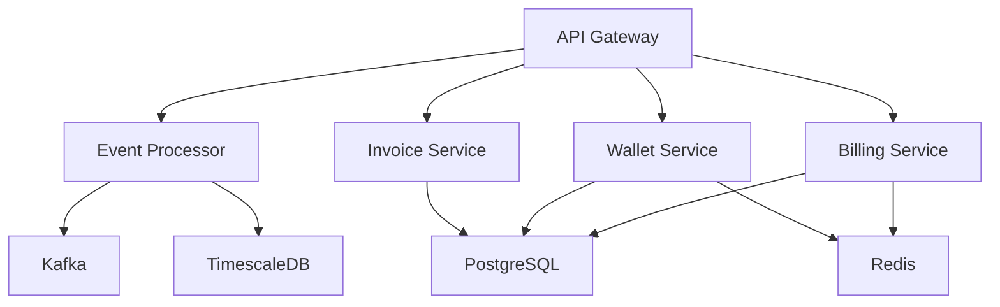

# OTPless Internal Billing System - Backend Services

## Overview

The OTPless Internal Billing System backend is a comprehensive microservices-based solution designed to handle billing operations for OTPless's authentication platform. The system processes high-volume usage events, manages customer wallets, generates invoices, and provides real-time analytics.

## Architecture

### Core Services

| Service | Technology | Purpose |
| --- | --- | --- |
| Event Processor | Node.js 18 | High-throughput event ingestion and processing |
| Billing Service | Java 17 | Core billing operations and invoice generation |
| Wallet Service | Go 1.20 | Real-time wallet balance management |
| Invoice Service | Python 3.11 | PDF invoice generation and management |

### System Components



## Prerequisites

### Required Software

- Docker Desktop >= 24.0.0
- Docker Compose >= 2.20.0
- Node.js >= 18.0.0 LTS
- Java OpenJDK 17
- Go 1.20
- Python 3.11
- kubectl >= 1.27
- AWS CLI >= 2.13

### Environment Setup

1. Clone the repository:
```bash
git clone https://github.com/otpless/billing-system.git
cd billing-system/backend
```

2. Install dependencies:
```bash
npm install
```

3. Configure environment variables:
```bash
cp .env.example .env
# Edit .env with your configuration
```

## Development

### Starting Services Locally

Development mode with hot reload:
```bash
npm run start:dev
```

Production mode:
```bash
npm run start:prod
```

### Service-Specific Commands

Event Processor:
```bash
cd event-processor
npm run dev
```

Billing Service:
```bash
cd billing-service
./mvnw spring-boot:run
```

Wallet Service:
```bash
cd wallet-service
go run cmd/server/main.go
```

Invoice Service:
```bash
cd invoice-service
uvicorn src.main:app --reload
```

## Security Setup

### SSL/TLS Configuration

1. Generate certificates:
```bash
./scripts/generate-certs.sh
```

2. Configure services:
```yaml
security:
  enableTLS: true
  certPath: /path/to/cert.pem
  keyPath: /path/to/key.pem
```

### API Authentication

1. Generate JWT signing keys:
```bash
./scripts/generate-jwt-keys.sh
```

2. Configure authentication:
```yaml
security:
  jwtSecret: ${JWT_SECRET}
  jwtExpiry: 3600
```

## Monitoring

### Metrics Setup

1. Start monitoring stack:
```bash
./scripts/monitoring-setup.sh
```

2. Access dashboards:
- Prometheus: http://localhost:9090
- Grafana: http://localhost:3000
- Jaeger: http://localhost:16686

### Health Checks

Service health endpoints:
- Event Processor: http://localhost:3000/health
- Billing Service: http://localhost:8080/actuator/health
- Wallet Service: http://localhost:8081/health
- Invoice Service: http://localhost:8000/health

## Deployment

### Local Development

```bash
docker-compose up --build
```

### Production Deployment

1. Build images:
```bash
docker-compose -f docker-compose.yml -f docker-compose.prod.yml build
```

2. Push to registry:
```bash
docker-compose -f docker-compose.yml -f docker-compose.prod.yml push
```

3. Deploy to Kubernetes:
```bash
kubectl apply -f k8s/
```

## Testing

Run all tests:
```bash
npm test
```

Run with coverage:
```bash
npm run test:coverage
```

## API Documentation

API documentation is available at:
- Event Processor: http://localhost:3000/docs
- Billing Service: http://localhost:8080/swagger-ui.html
- Wallet Service: http://localhost:8081/swagger
- Invoice Service: http://localhost:8000/docs

## Contributing

1. Fork the repository
2. Create a feature branch
3. Commit changes
4. Push to the branch
5. Create a Pull Request

## License

Proprietary - OTPless © 2023

## Support

For support, contact:
- Email: engineering@otpless.com
- Slack: #billing-system